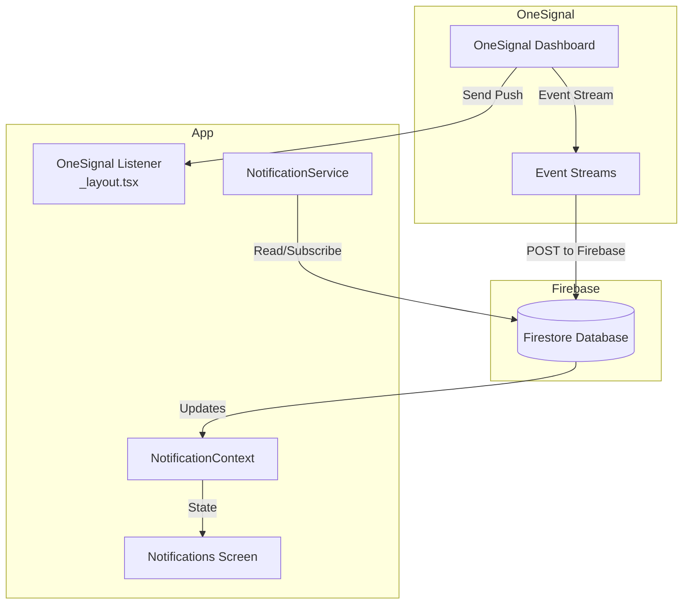

# Design Document: Notification Persistence

## Overview

This feature integrates Firebase Firestore with the existing OneSignal push notification system to provide persistent notification storage and display. OneSignal's Event Streams feature automatically posts notification data to Firebase when notifications are sent from the OneSignal dashboard. The app simply fetches and displays notifications from Firebase.

The system leverages:

- **OneSignal** (already integrated) for push notification delivery
- **OneSignal Event Streams** for automatic Firebase storage (configured in OneSignal dashboard)
- **Firebase Firestore** (already in dependencies) for persistent storage
- **React Native** notification UI (already built with dummy data)

## Architecture



## Components and Interfaces

### 1. Notification Data Model

```typescript
interface Notification {
  id: string; // Firestore document ID
  title: string; // Notification title
  body: string; // Notification message body
  isRead: boolean; // Read status (default: false)
  createdAt: Date; // Timestamp when notification was created
  data?: Record<string, any>; // Optional additional payload data
}
```

### 2. NotificationService

A service module for Firestore operations (read-only + mark as read):

```typescript
// services/notification-service.ts
interface NotificationService {
  // Fetch all notifications
  getNotifications(): Promise<Notification[]>;

  // Subscribe to real-time updates
  subscribeToNotifications(
    callback: (notifications: Notification[]) => void
  ): () => void;

  // Mark notification as read
  markAsRead(notificationId: string): Promise<void>;
}
```

### 3. NotificationContext

React context for state management:

```typescript
// contexts/NotificationContext.tsx
interface NotificationContextType {
  notifications: Notification[];
  unreadCount: number;
  loading: boolean;
  error: Error | null;
  markAsRead: (notificationId: string) => Promise<void>;
}
```

### 4. Updated Notifications Screen

The existing `app/notifications.tsx` will be updated to:

- Use `NotificationContext` instead of dummy data
- Call `markAsRead` when a notification is tapped
- Display loading and error states

## Data Models

### Firestore Collection Structure

The collection structure should match what OneSignal Event Streams posts. Recommended structure:

```
notifications/
  ├── {documentId}/
  │   ├── title: string
  │   ├── body: string
  │   ├── isRead: boolean (default: false)
  │   ├── createdAt: Timestamp
  │   └── data: map (optional)
```

### OneSignal Event Streams Configuration

In OneSignal dashboard, configure Event Streams to POST to your Firebase endpoint with this body format:

```json
{
  "title": "{{heading}}",
  "body": "{{content}}",
  "isRead": false,
  "createdAt": "{{completed_at}}"
}
```

### Serialization Functions

```typescript
// Convert Firestore document to Notification
function fromFirestoreDoc(doc: FirestoreDocSnapshot): Notification;
```

## Correctness Properties

_A property is a characteristic or behavior that should hold true across all valid executions of a system-essentially, a formal statement about what the system should do. Properties serve as the bridge between human-readable specifications and machine-verifiable correctness guarantees._

### Property 1: Notifications are sorted by timestamp descending

_For any_ list of notifications returned from the fetch operation, the list SHALL be ordered by createdAt in descending order (newest first).
**Validates: Requirements 2.2**

### Property 2: Unread count equals unread notifications

_For any_ set of notifications, the unread count badge SHALL equal the count of notifications where isRead is false.
**Validates: Requirements 3.3**

### Property 3: Mark as read updates status

_For any_ notification, after calling markAsRead, the notification's isRead field in Firestore SHALL be true.
**Validates: Requirements 4.1**

### Property 4: Deserialization produces valid Notification objects

_For any_ valid Firestore document with required fields, deserializing SHALL produce a Notification object with all field values correctly mapped.
**Validates: Requirements 7.2**

## Error Handling

| Error Scenario         | Handling Strategy                                        |
| ---------------------- | -------------------------------------------------------- |
| Firestore read failure | Show error state in UI, allow retry                      |
| Network unavailable    | Firestore offline persistence handles this automatically |

| Missing required fields | Log warning, skip notification |

## Testing Strategy

### Property-Based Testing Library

- **fast-check** for TypeScript property-based testing

### Unit Tests

- Test deserialization function
- Test sorting logic for timestamps
- Test unread count calculation

### Property-Based Tests

Each correctness property will be implemented as a property-based test using fast-check:

1. **Property 1**: Generate random timestamps, verify sorting is correct
2. **Property 2**: Generate notifications with random read states, verify count matches
3. **Property 3**: Generate notifications, mark as read, verify status change
4. **Property 4**: Generate random Firestore documents, verify deserialization produces valid objects

### Test Configuration

- Property tests will run a minimum of 100 iterations
- Each test will be tagged with the format: `**Feature: notification-persistence, Property {number}: {property_text}**`
