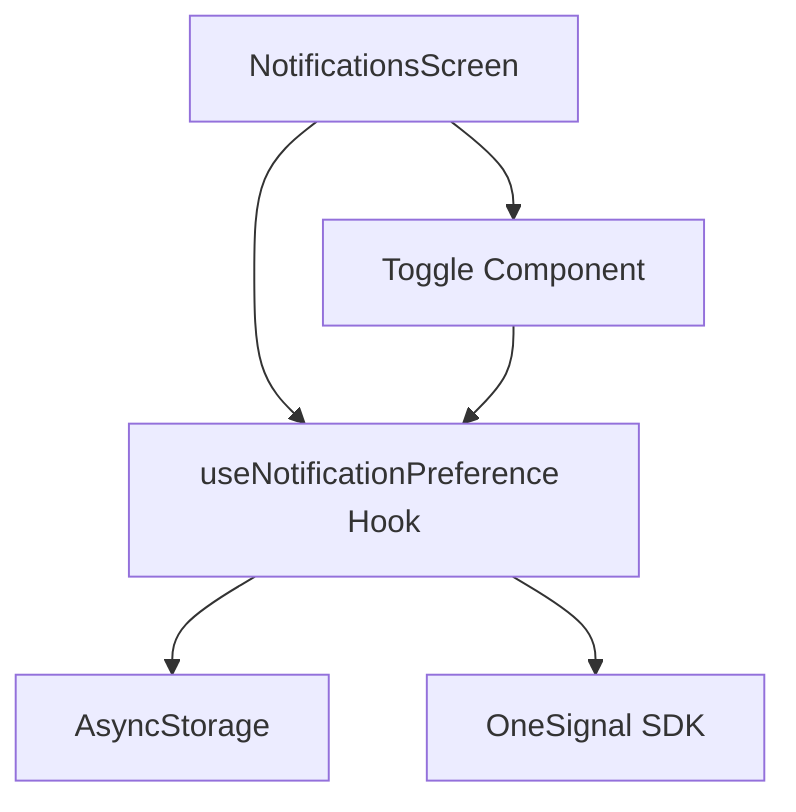

# Design Document: Notification Toggle

## Overview

This feature adds a notification toggle control to the NotificationsScreen, enabling users to enable or disable push notifications directly from the app. The implementation uses a custom React hook to manage notification preferences, integrating with OneSignal for push notification control and AsyncStorage for local persistence.

## Architecture

The feature follows a layered architecture:



- **Presentation Layer**: NotificationsScreen with Toggle UI component
- **State Management Layer**: useNotificationPreference custom hook
- **Persistence Layer**: AsyncStorage for local preference storage
- **Integration Layer**: OneSignal SDK for push notification control

## Components and Interfaces

### useNotificationPreference Hook

```typescript
interface UseNotificationPreferenceReturn {
  /** Current notification preference state */
  isEnabled: boolean;
  /** Loading state during async operations */
  isLoading: boolean;
  /** Error state if operation fails */
  error: Error | null;
  /** Toggle the notification preference */
  togglePreference: () => Promise<void>;
}

function useNotificationPreference(): UseNotificationPreferenceReturn;
```

### NotificationToggle Component

```typescript
interface NotificationToggleProps {
  /** Current enabled state */
  isEnabled: boolean;
  /** Loading state */
  isLoading: boolean;
  /** Callback when toggle is pressed */
  onToggle: () => void;
  /** Optional test ID for testing */
  testID?: string;
}

function NotificationToggle(props: NotificationToggleProps): JSX.Element;
```

### Preference Storage Functions

```typescript
const PREFERENCE_KEY = "notification_preference";

/** Serialize and store preference */
function savePreference(enabled: boolean): Promise<void>;

/** Retrieve and deserialize preference */
function loadPreference(): Promise<boolean | null>;
```

## Data Models

### Stored Preference Format

The notification preference is stored in AsyncStorage as a JSON boolean:

```json
{
  "key": "notification_preference",
  "value": "true" | "false"
}
```

### State Model

```typescript
interface NotificationPreferenceState {
  isEnabled: boolean;
  isLoading: boolean;
  error: Error | null;
}
```

## Correctness Properties

_A property is a characteristic or behavior that should hold true across all valid executions of a system-essentially, a formal statement about what the system should do. Properties serve as the bridge between human-readable specifications and machine-verifiable correctness guarantees._

Based on the prework analysis, the following correctness properties must be validated:

### Property 1: Toggle reflects current preference state

_For any_ notification preference state (enabled or disabled), the toggle component SHALL display the visual state matching that preference.
**Validates: Requirements 1.2**

### Property 2: Toggle action inverts state

_For any_ current notification preference state, invoking the toggle action SHALL result in the opposite state being set.
**Validates: Requirements 2.1, 2.2**

### Property 3: State changes are persisted

_For any_ toggle action that changes the preference state, the new state SHALL be retrievable from AsyncStorage immediately after the action completes.
**Validates: Requirements 2.3**

### Property 4: Stored preferences are applied on initialization

_For any_ stored preference value in AsyncStorage, initializing the hook SHALL result in that value being applied to the current state and OneSignal.
**Validates: Requirements 3.2**

### Property 5: Preference serialization round-trip

_For any_ boolean preference value, serializing to AsyncStorage and then deserializing SHALL return the original value.
**Validates: Requirements 3.4, 3.5**

### Property 6: State reverts on save failure

_For any_ toggle action that fails to persist, the preference state SHALL revert to its previous value.
**Validates: Requirements 4.3**

## Error Handling

### Storage Errors

- If AsyncStorage read fails on initialization, default to enabled state
- If AsyncStorage write fails, revert to previous state and display error

### OneSignal Errors

- If OneSignal subscription update fails, revert preference and display error
- Log errors for debugging purposes

### Error Display

- Show toast or inline error message when operations fail
- Error messages should be user-friendly and actionable

## Testing Strategy

### Property-Based Testing

The implementation will use **fast-check** as the property-based testing library for TypeScript/JavaScript.

Each property-based test MUST:

- Run a minimum of 100 iterations
- Be tagged with a comment referencing the correctness property: `**Feature: notification-toggle, Property {number}: {property_text}**`
- Test the property across randomly generated inputs

### Unit Tests

Unit tests will cover:

- Component rendering with different states
- Hook initialization behavior
- Default value when no stored preference exists
- Accessibility attributes presence

### Test Structure

```
src/
├── hooks/
│   ├── use-notification-preference.ts
│   └── __tests__/
│       └── use-notification-preference.test.ts  # Unit + Property tests
├── components/
│   └── ui/
│       ├── NotificationToggle.tsx
│       └── __tests__/
│           └── NotificationToggle.test.tsx      # Component tests
```

### Mocking Strategy

- Mock AsyncStorage for storage tests
- Mock OneSignal SDK for integration tests
- Use real implementations where possible for property tests
