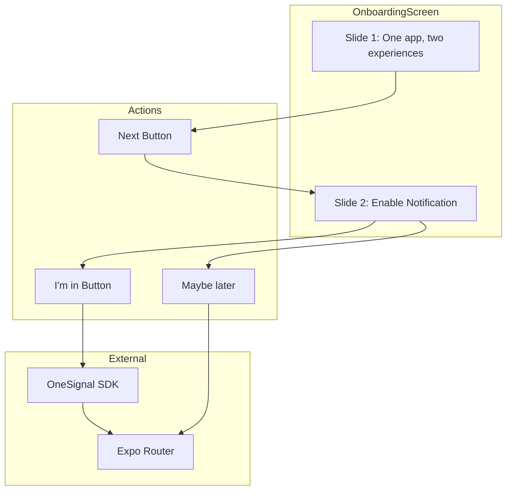

# Design Document: Onboarding Simplification

## Overview

Modifikasi komponen `OnboardingScreen` yang sudah ada untuk menyederhanakan alur onboarding dari tiga slide menjadi dua slide, dengan integrasi OneSignal untuk request notification permission pada slide kedua.

## Architecture



## Components and Interfaces

### Modified Component: OnboardingScreen

File: `src/screens/OnboardingScreen.tsx`

#### Changes Required:

1. **SLIDES Array**: Reduce from 3 slides to 2 slides
   - Slide 1: "One app, two experiences" (existing content from slide 3)
   - Slide 2: "Enable Notification" (new content)

2. **Button Logic**: Modify button behavior based on slide index
   - Slide 1: "Next" button → navigate to slide 2
   - Slide 2: "I'm in" button → request notification permission, then navigate to main app
   - Slide 2: "Maybe later" button → navigate to main app without permission request

3. **OneSignal Integration**: Add notification permission request function

### Interface: Slide Data Structure

```typescript
interface SlideData {
  id: number;
  illustration: ImageSource;
  title: string;
  description: string;
}
```

### New Function: requestNotificationPermission

```typescript
const requestNotificationPermission = async (): Promise<void> => {
  try {
    await OneSignal.Notifications.requestPermission(true);
  } finally {
    router.replace("/(tabs)");
  }
};
```

## Data Models

### Updated SLIDES Constant

```typescript
const SLIDES: SlideData[] = [
  {
    id: 1,
    illustration: require("@/assets/images/onboarding-3-illustration-3420cb.png"),
    title: "One app, two experiences",
    description:
      "Access both hotel booking and the Swiss-Belexecutive Member Zone in a single platform. Choose your journey right after signing in.",
  },
  {
    id: 2,
    illustration: require("@/assets/images/notification-illustration.png"), // atau ilustrasi yang sesuai
    title: "Enable Notification",
    description:
      "Stay updated with exclusive offers, booking confirmations, and important updates. Never miss a moment.",
  },
];
```

## Correctness Properties

_A property is a characteristic or behavior that should hold true across all valid executions of a system-essentially, a formal statement about what the system should do. Properties serve as the bridge between human-readable specifications and machine-verifiable correctness guarantees._

### Property 1: Slide count is exactly two

_For any_ render of OnboardingScreen, the SLIDES array SHALL contain exactly 2 items.
**Validates: Requirements 1.1**

### Property 2: Button text changes based on slide position

_For any_ slide index in the onboarding flow, when on the first slide (index 0) the primary button SHALL display "Next", and when on the last slide (index 1) the primary button SHALL display "I'm in".
**Validates: Requirements 1.4, 2.3**

### Property 3: Secondary action visibility on last slide

_For any_ slide index, the "Maybe later" secondary action SHALL only be visible when on the last slide (index 1).
**Validates: Requirements 3.1**

## Error Handling

1. **OneSignal Permission Request Failure**: If OneSignal permission request fails, the app should still navigate to the main screen. The `finally` block ensures navigation happens regardless of permission result.

2. **Image Loading Failure**: Use expo-image's built-in error handling. If illustration fails to load, the slide should still display title and description.

## Testing Strategy

### Unit Tests

1. Test SLIDES array has exactly 2 items
2. Test first slide has correct title "One app, two experiences"
3. Test second slide has correct title "Enable Notification"
4. Test button text logic based on currentIndex

### Property-Based Tests

Using `fast-check` library for property-based testing:

1. **Property Test: Button text consistency**
   - Generate random valid slide indices (0 or 1)
   - Verify button text matches expected value for each index

2. **Property Test: Secondary action visibility**
   - Generate random valid slide indices
   - Verify "Maybe later" is only visible when index === 1

### Integration Tests

1. Test "I'm in" button triggers OneSignal.Notifications.requestPermission
2. Test navigation to "/(tabs)" after permission flow
3. Test "Maybe later" navigates without calling OneSignal
