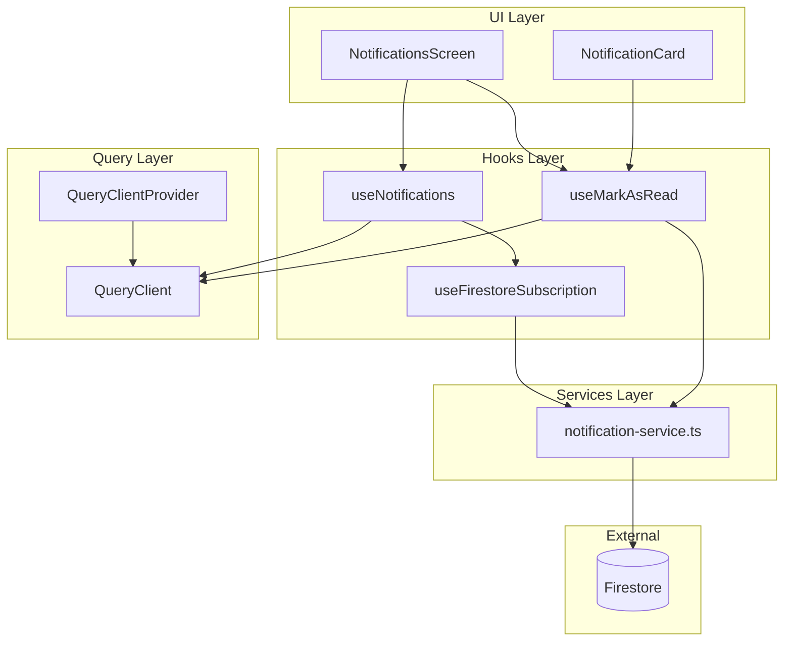
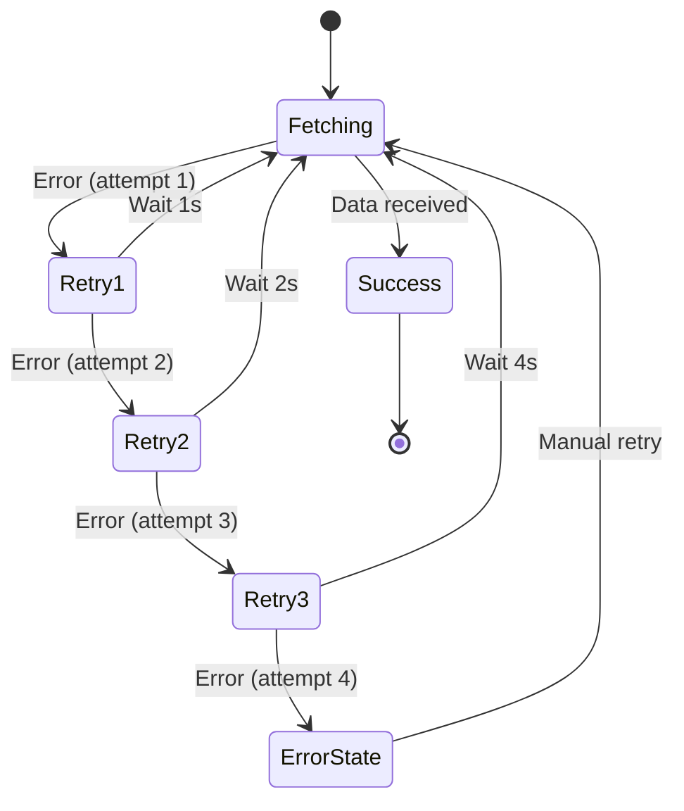

# Design Document: TanStack Query Refactor for Notifications

## Overview

This design document outlines the architecture for refactoring the notification data fetching system from manual `useEffect`-based patterns to TanStack Query. The refactored system will provide robust data fetching with automatic retries, caching, real-time Firestore synchronization, and optimistic updates for mutations.

The architecture follows a clean separation of concerns:

- **Services Layer**: Firestore operations (unchanged)
- **Hooks Layer**: TanStack Query hooks for data fetching
- **UI Layer**: React components consuming hooks

## Architecture



## Components and Interfaces

### 1. QueryClient Configuration

```typescript
// src/lib/query-client.ts
import { QueryClient } from "@tanstack/react-query";

export const queryClient = new QueryClient({
  defaultOptions: {
    queries: {
      retry: 3,
      retryDelay: (attemptIndex) => Math.min(1000 * 2 ** attemptIndex, 30000),
      staleTime: 30 * 1000, // 30 seconds
      gcTime: 5 * 60 * 1000, // 5 minutes (formerly cacheTime)
      refetchOnWindowFocus: true,
      refetchOnReconnect: true,
    },
    mutations: {
      retry: 1,
    },
  },
});
```

### 2. Query Keys

```typescript
// src/lib/query-keys.ts
export const queryKeys = {
  notifications: {
    all: ["notifications"] as const,
    list: () => [...queryKeys.notifications.all, "list"] as const,
    detail: (id: string) =>
      [...queryKeys.notifications.all, "detail", id] as const,
  },
} as const;
```

### 3. useNotifications Hook

```typescript
// src/hooks/use-notifications.ts
interface UseNotificationsReturn {
  notifications: Notification[];
  unreadCount: number;
  isLoading: boolean;
  isError: boolean;
  error: Error | null;
  refetch: () => Promise<void>;
}

export function useNotifications(): UseNotificationsReturn;
```

### 4. useMarkAsRead Hook

```typescript
// src/hooks/use-mark-as-read.ts
interface UseMarkAsReadReturn {
  markAsRead: (notificationId: string) => Promise<void>;
  isPending: boolean;
  isError: boolean;
  error: Error | null;
}

export function useMarkAsRead(): UseMarkAsReadReturn;
```

### 5. Firestore Subscription Integration

```typescript
// src/hooks/use-firestore-subscription.ts
export function useFirestoreSubscription<T>(
  queryKey: readonly unknown[],
  subscribeFn: (callback: (data: T) => void) => () => void
): void;
```

## Data Models

### Notification Type (unchanged)

```typescript
// src/types/notification.ts
export interface Notification {
  id: string;
  title: string;
  body: string;
  isRead: boolean;
  createdAt: Date;
  data?: Record<string, unknown>;
}
```

### Query State Types

```typescript
// Derived from TanStack Query
interface NotificationQueryState {
  data: Notification[] | undefined;
  isLoading: boolean;
  isFetching: boolean;
  isError: boolean;
  error: Error | null;
  isStale: boolean;
}
```

## Correctness Properties

_A property is a characteristic or behavior that should hold true across all valid executions of a system-essentially, a formal statement about what the system should do. Properties serve as the bridge between human-readable specifications and machine-verifiable correctness guarantees._

### Property 1: Unread count consistency

_For any_ list of notifications, the computed unread count SHALL equal the count of notifications where `isRead` is `false`.

**Validates: Requirements 2.5**

### Property 2: Optimistic update correctness

_For any_ notification that is marked as read, the local cache SHALL immediately reflect `isRead: true` before server confirmation, and the unread count SHALL decrease by exactly 1.

**Validates: Requirements 4.2, 4.4**

### Property 3: Optimistic rollback on failure

_For any_ failed mark-as-read mutation, the cache SHALL revert to the previous state where the notification's `isRead` value is unchanged from before the mutation attempt.

**Validates: Requirements 4.3**

### Property 4: Cache update on subscription

_For any_ Firestore real-time update, the TanStack Query cache SHALL be updated to reflect the new notification data within the same event loop tick.

**Validates: Requirements 3.1**

### Property 5: Retry behavior

_For any_ failed notification fetch, the system SHALL retry exactly 3 times with exponential backoff delays of 1s, 2s, and 4s respectively before entering error state.

**Validates: Requirements 2.3**

## Error Handling

### Error Types

1. **Firebase Not Initialized**: Occurs when Firestore is accessed before Firebase native module loads
   - Detection: Check `firebase.apps.length === 0`
   - Handling: Show specific connection error message, enable retry

2. **Network Error**: Occurs when device is offline
   - Detection: Error type or message indicates network failure
   - Handling: Show offline message, auto-retry when online

3. **Firestore Permission Error**: Occurs when security rules deny access
   - Detection: Error code `permission-denied`
   - Handling: Show access denied message, no auto-retry

### Error Recovery Flow



## Testing Strategy

### Unit Testing

Unit tests will verify:

- QueryClient configuration values
- Hook return types and structure
- Pure functions like `computeUnreadCount`

Testing framework: Jest with React Native Testing Library

### Property-Based Testing

Property-based tests will use **fast-check** library to verify correctness properties:

1. **Unread count property**: Generate random notification arrays, verify count computation
2. **Optimistic update property**: Generate random notifications, simulate mark-as-read, verify cache state
3. **Rollback property**: Simulate mutation failures, verify state restoration

Each property-based test MUST:

- Run minimum 100 iterations
- Be tagged with format: `**Feature: tanstack-query-refactor, Property {number}: {property_text}**`
- Reference the correctness property from this design document

### Integration Testing

Integration tests will verify:

- Firestore subscription lifecycle
- Cache synchronization with real-time updates
- Error state transitions

## File Structure

```
src/
├── lib/
│   ├── query-client.ts      # QueryClient configuration
│   └── query-keys.ts        # Centralized query keys
├── hooks/
│   ├── use-notifications.ts # Main notifications hook
│   ├── use-mark-as-read.ts  # Mark as read mutation hook
│   └── use-firestore-subscription.ts # Generic Firestore subscription
├── services/
│   └── notification-service.ts # Firestore operations (existing)
├── types/
│   └── notification.ts      # Type definitions (existing)
└── screens/
    └── NotificationsScreen.tsx # UI component (updated)
```
